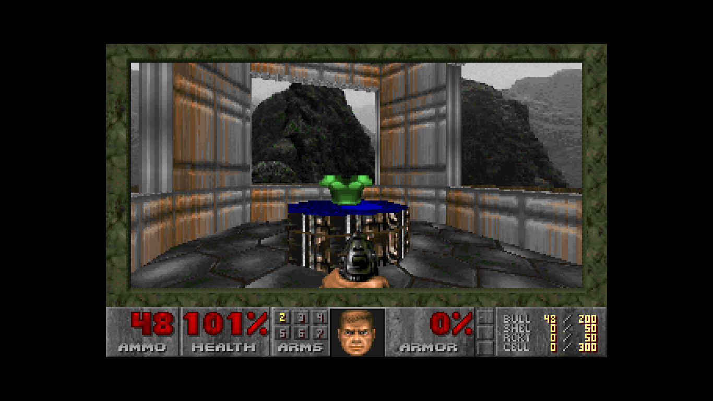
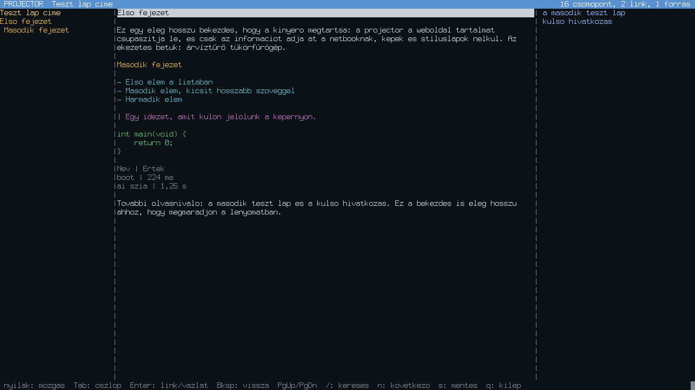
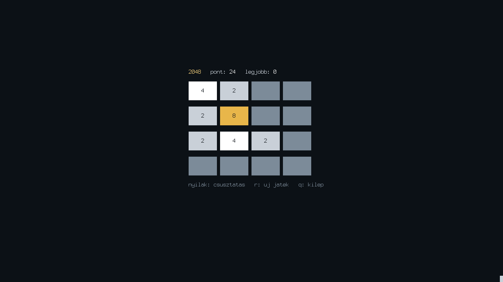

# AO-OS

Saját kernelű, minimális "AI-terminál" operációs rendszer egy Acer Aspire One 725 netbookra
(AMD C-70, 2 GB RAM, 1366×768). Nincs benne Linux, POSIX, libc vagy ELF: saját bootloader,
saját 64 bites kernel, saját shell, saját hálózati stack, és egy capability-alapú agent-modell,
amelyben egy távoli AI-modell (Claude vagy Gemini) csak azt teheti a gépen, amit a manifestje enged.

*AO-OS is a from-scratch, minimal "AI terminal" OS for an Acer Aspire One netbook: own bootloader,
own 64-bit kernel, own shell and TCP/IP, and a capability model for AI agents talking to a remote model
through a small bridge. Documentation is in Hungarian. And yes, it runs Doom.*



**Fut rajta a Doom.** A fenti kép a netbookról jött: az OS saját F12-es képernyőképe, a saját hídon át a PC-re
küldve. A PureDOOM motor változtatás nélkül fordult le a freestanding toolchainnel, és tizenkét visszahívással
kapcsolódik a rendszerhez: fájlok a saját fájlrendszerről, memória a saját foglalóból, kép az `fb` capability-n át,
billentyűk a nyers konzolmódból, az FPU-állapotot a kernel menti taskváltáskor. Nincs libc, nincs POSIX, nincs Linux.

## Állapot

A Phase 0–3 terv teljesült, valódi hardveren:

| | |
|---|---|
| boot → prompt a belső SSD-ről | ~210 ms |
| `ai szia` a hídon át (Gemini 2.5 Flash, titkosított csatorna) | ~1,2 s |
| `agent coder` fájlt ír a `/project/src` alá (Claude Sonnet 5 / Gemini) | 5,5 s / 2,1 s |
| Doom (PureDOOM-port, 960×600, 35 Hz) a netbookon | fut |
| `doom1.wad` (4,2 MB) átvitele a PC-ről a hídon át | 8,4 s |
| bootloader + kernel + programok + híd + tesztek | ~12 300 sor C, asm, Python |

Részletek, döntések és mérések: [docs/AO-OS-Architecture-v0.1.md](docs/AO-OS-Architecture-v0.1.md).
A netbook ↔ híd protokoll: [docs/AOP.md](docs/AOP.md).

## Mi van benne

- **Bootloader** (`boot/`): MBR + real módú stage2 (A20, E820, VBE-mód választás felbontás szerint, lapozótáblák, közvetlen ugrás 64 bites long módba).
- **Kernel** (`kernel/`): higher-half, GDT/TSS, IDT, PIT, PAT, fizikai és virtuális memóriakezelés, kupac, framebuffer-konzol UTF-8-cal és görgetéssel, i8042 billentyűzet (US/HU), PCI, AHCI, ACPI, soros port.
- **Fájlrendszerek**: AOFS v1 (csak olvasható ramdisk), AOFS v2 (lemez, 4 KiB blokkok, piszkos-jelző), ramfs (`/tmp`, `/sys`), VFS mount-táblával, panic-tároló szektor.
- **Taskok**: ring 3 programok saját címtérrel (AOX lapos formátum), syscall/sysret, 16 handle/task, várakozási sorok, korlátok (memória, CPU, határidő), kill; egy hibás program csak magát viszi el.
- **Capability-modell**: szöveges manifest (`fs.read`, `fs.write`, `exec`, `net`, `console`, `spawn`, …) glob-mintákkal, részhalmaz-ellenőrzés indításkor, `cap_check` minden erőforrás-syscallon, audit-napló (`/sys/audit`).
- **Hálózat**: Ethernet/ARP/IPv4/ICMP/UDP/DHCP/TCP, e1000 (QEMU) és Realtek RTL8101E (netbook) driver.
- **AI-agent**: `agentd` beszél a híddal az AOP protokollon; a modell hat eszközt kap (`fs_read`, `fs_write`, `fs_mkdir`, `fs_list`, `task_run`, `ask_user`), mindegyik egy-egy syscall, tehát a kernel kényszeríti ki a manifestet. A csatorna előre megosztott kulccsal ChaCha20-Poly1305-tel titkosított.
- **Híd** (`tools/bridge.py`): a PC-n fut, a Claude API-t (Anthropic SDK) vagy a Google AI Studio API-t hívja. Az API-kulcs sosem jut a netbookra.

## Eszközök (Windows)

LLVM (clang, ld.lld, llvm-objcopy), NASM, QEMU, Python 3.

```
winget install LLVM.LLVM NASM.NASM SoftwareFreedomConservancy.QEMU
```

## Használat

```
python ao.py tools                    eszközök ellenőrzése
python ao.py build                    bootloader + kernel + programok + build/ao.img
python ao.py run                      QEMU ablakban, soros port a konzolon
python tests/smoke.py                 fej nélküli QEMU-teszt, 4 boot-menet, szimulált híddal
python ao.py usb \\.\PhysicalDriveN   pendrive-ra írás (a teljes eszközt felülírja!)
```

Netbookon először: pendrive-ról boot, `install` (teljes telepítés a belső lemezre). Utána a napi kör
pendrive nélkül: a PC-n `python ao.py build` (a hídnak futnia kell), a netbookon `update`. A netbook a
hídon át lehúzza a boot-területet (`share/boot.img`, 1 MiB), ellenőrzi, a lemezre írja és újraindul;
az első induláskor a kernel a friss ramdiskből másolja át a programokat. A `/state` és a `/project`
megmarad. `update rd` a régi, pendrive-os út, `update force` akkor is frissít, ha ugyanaz a build fut.
A build bélyege (dátum + git hash) a splash fejlécében látszik. `help` a parancsokhoz.

## AI-híd

```
setx ANTHROPIC_API_KEY ...            vagy  setx GEMINI_API_KEY ...
python tools\bridge.py --gen-psk      kulcs a ~/.ao-psk fájlba; kiírja a netbookon beírandó sort
python tools\bridge.py [--provider claude|gemini] [--model ...] [--effort low|medium|high]
```

A netbookon `/state/ai/bridge` a híd címe (`ip:port`), `/state/ai/psk` a kulcs. Parancsok:
`ai <kérdés>` (egyszeri beszélgetés), `agent coder <feladat>` (a `coder` manifest jogaival dolgozik),
`shot` (a képernyő szövege a PC `shots/` mappájába), `copy` / `paste` (a PC vágólapja mindkét irányba).
A híd netbook nélkül is próbálható: `python tests\aop_client.py "feladat"`.

**Projector:** `projector https://…` vagy `projector <kérdés>`: a híd letölti és lecsupaszítja az oldalt
(kérdésnél a DuckDuckGo találati lapját), a netbook egy szemantikus lenyomatot kap (JSON, `docs/AOP.md`),
és a teljes képernyőn rendezi el: vázlat, tartalom, linkek; nyilak, Tab, Enter, Backspace, `/`, `s`, `q`.
`projector --dump …` szövegként írja ki. PC-n külön is próbálható: `python tools\projector.py <cím | kérdés>`.

**Hű nézet:** a projectorban `v` (vagy `projector --view …`) a PC böngészőmotorjával renderelt képet mutatja
teljes képernyőn, linkről linkre Tab-bal, Enter megnyit. A PC-n ehhez `pip install playwright pillow` és
`python -m playwright install chromium` kell; a netbookon semmi.

**Sebesség:** a híd PSK-titkosítása `pip install cryptography` mellett C-ben fut (nélküle tiszta Python,
~0,25 MB/s, ami fojtja a nagy feltöltéseket, például a képernyőképeket; a híd indításkor szól, ha ez hiányzik).
Nyers TCP-mérés a netbookról: a PC-n `python tests\sink.py`, a netbookon `netbench <PC IP> 9020 [MB]`;
a `net` parancs TCP-számlálókat is mutat (újraküldés, nulla ablak, ablakkorlát).

**Szerkesztő és segédprogramok:** `edit FÁJL` teljes képernyős szerkesztő (Ctrl+S ment, Ctrl+Q kilép,
Ctrl+F keres, Ctrl+N következő, Ctrl+G sorra ugrik, Ctrl+K sor kivágása, Ctrl+U beillesztés, Enter örökli
a behúzást, Tab 4 szóköz). Fájlokhoz: `cp`, `mv`, `head`, `tail`, `more`, `wc`, `grep [-i] MINTA FÁJL|KÖNYVTÁR`
(könyvtárban rekurzív), `find [KÖNYVTÁR] [MINTA]` (`*`, `?`), `hexdump`, `stat`, `du`, `df`, `tree`.

Indításkor a shell a `/state/rc` (vagy `/etc/rc`) sorait futtatja, például `append /state/rc kbd hu`.
Játék is van: `2048` (nyilak, `r` új játék, `q` kilép; a legjobb eredmény a `/state/games/2048` fájlban).

**Doom.** A PureDOOM motor (`user/doom/PureDOOM.h`, GPL) az AO-OS-hez kötve: saját `malloc`, `fb` capability,
nyers billentyűzet, FPU-állapot a kernelben. A `doom.aox` és a shareware `doom1.wad` a PC `share/` mappájában van
(a build oda teszi a programot, a WAD-ot a felhasználó teszi oda), a netbookon:

```
fetch doom.aox /state/games
fetch doom1.wad /state/games
doom
```

Nyilak, Ctrl tűz, Space használat, Shift futás, Alt oldalazás, Esc menü. Hang nincs.

**Képernyőkép bárhol:** F12 (a Doomban is) a képernyő pixeleit a `/state/shots/N.ppm` fájlba menti; `shot /state/shots/1.ppm`
a PC `shots/` mappájába küldi, ahol PNG lesz belőle. Szöveges módban a `shot` a konzol szövegét küldi.

| projector | 2048 |
|---|---|
|  |  |
`time`, `date` és a `set` alparancsuk a CMOS órát kezeli; `status` az állapot-összefoglaló; Tab kiegészít.

## Elrendezés

```
boot/      stage1.asm, stage2.asm
kernel/    arch/ cpu/ mm/ drv/ fs/ task/ cap/ net/ shell/ include/ lib/ kmain.c
user/      aolib (syscall-burkolók), crypto, agentd és a tesztprogramok, aox.ld, crt0.asm
rootfs/    a ramdisk tartalma (etc/agents/*.cap manifestek, etc/ai/bridge)
tools/     ao.py-segédek: mkimage, mkaofs, mkfont, bridge, aop, aocrypto, screenshot
tests/     smoke.py (QEMU), fake_bridge.py, aop_client.py
docs/      architektúra-terv és a protokoll leírása
```

## Boot-jelzők a képernyőn

`1` stage1 · `2` stage2 · `A` A20 · `U` unreal · `M` E820 · `K` kernel betöltve · `R` ramdisk · majd grafikus mód.
Kisbetűs karakter = hiba az adott lépésnél (`a` A20, `m` E820, `d` lemez, `v` nincs VBE-mód).
